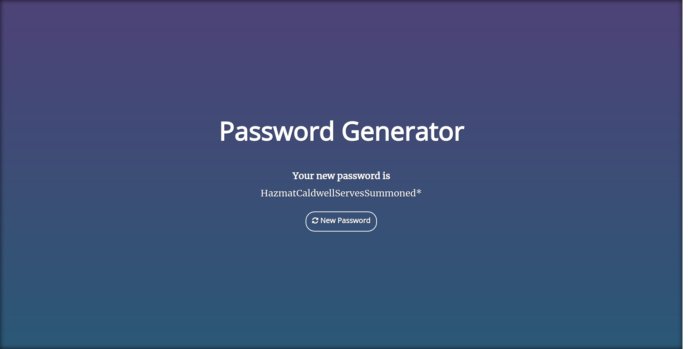
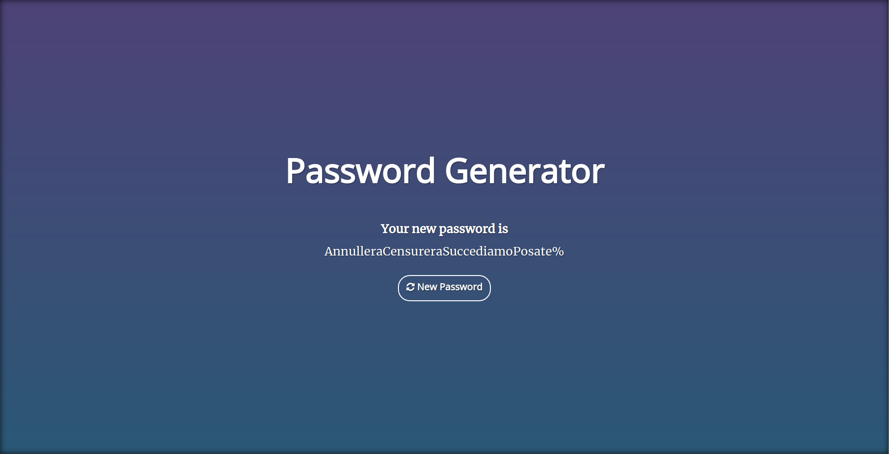
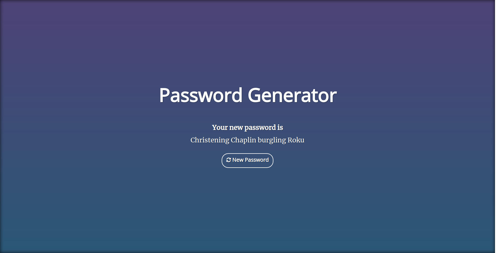

# flask-password
Flask Password is a password generator based on the [XKCD 936](https://xkcd.com/936/) comic.

Flask Password is written in Python3 and runs as a web application atop the [Flask](https://palletsprojects.com/p/flask/) framework. For a
complete list of requirements, see `requirements.txt`. The code is available [on GitHub](https://github.com/synackray/flask-password).

## Demo
A demo of Flask Password can be found [here](https://www.icarustech.com/flask-password/).

## Screenshots

## Usage
Flask Password has two ways of setting optional variables, through GET and POST HTTP methods. If POST method is used, cookies are created for persistence. However, GET method will always override cookie-stored values. The following variables are defined.

| Key       | Value  | Cookie Name  | Description                      |
|-----------|--------|--------------|----------------------------------|
| debug     | 1      | fp_debug     | Shows key/value pairs in footer  |
| language  | en, it | fp_language  | Selects word dictionary language |
| spaces    | 0, 1   | fp_spaces    | Include spaces in password       |
| symbol    | 0, 1   | fp_symbol    | Include symbol in password       |
| uppercase | 0, 1   | fp_uppercase | Include uppercase in password    |

## Installation
1. Browse to the flask-password project folder.
2. Create Python Virtual Environment [(venv)](https://docs.python.org/3/library/venv.html) and activate it.
3. Install the package requirements by running `pip install -r requirements.txt`.
4. Install Gunicorn. An example script of a systemd service script is provided in [docs/flask-password.service](docs/flask-password.service)
5. Install a web server. An Example script of NGINX proxied to Gunicorn is provided in [docs/nginx.conf](docs/nginx.conf)

## Thanks
A special thanks to [@haydenryan](https://github.com/haydenryan/) for the [OnePagers-gradient](https://github.com/haydenryan/OnePagers-gradient) templates used in this project.
